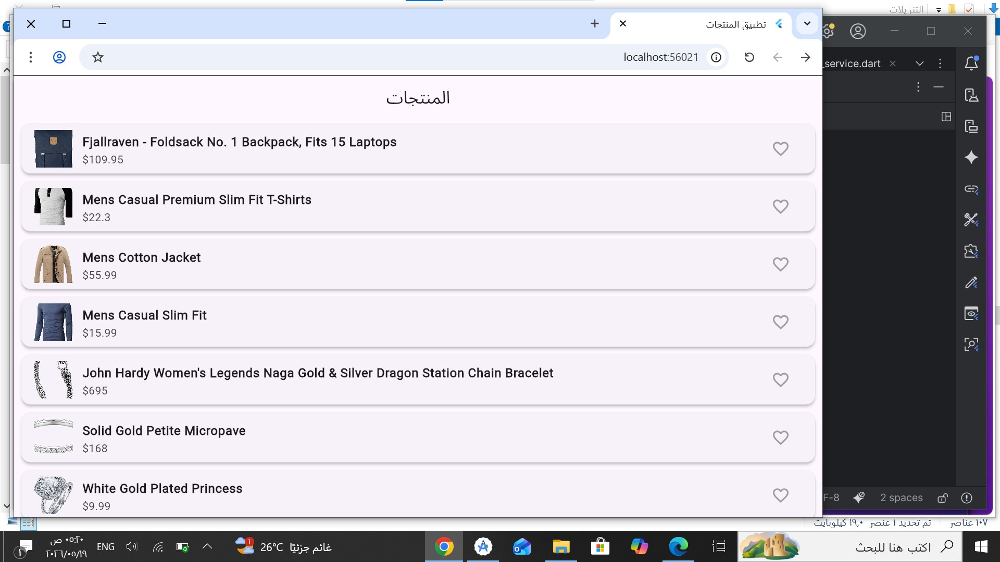
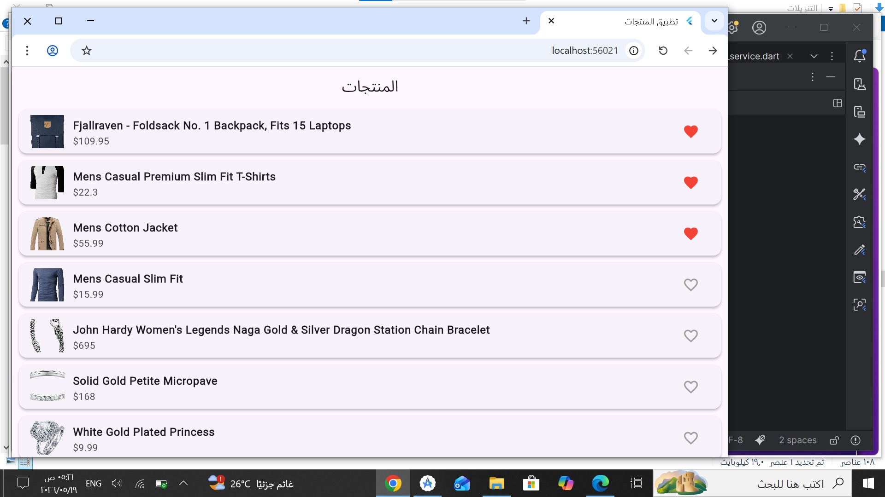
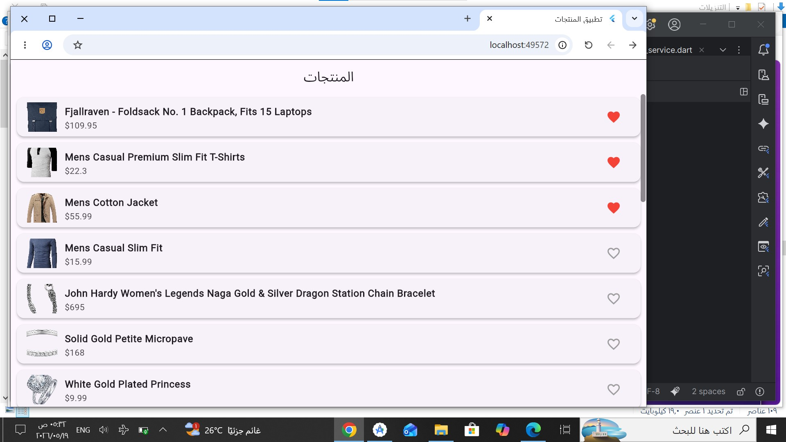

# تطبيق معرض المنتجات مع دعم التصفح دون اتصال (Offline Mode)

تطبيق متكامل لبيع وعرض المنتجات تم بناؤه باستخدام إطار العمل **Flutter**، يهدف إلى تحقيق معايير الكفاءة عبر جلب البيانات الحقيقية ودعم تصفح التطبيق وحفظ المفضلة بشكل دائم دون الحاجة للاتصال بالإنترنت.

## ✨ الميزات الرئيسية (Key Features)
1. **جلب بيانات حقيقية (REST API):** الاتصال بـ FakeStore API وفك تشفير الـ JSON وتحويله إلى كائنات داخل التطبيق.
2. **دعم وضع عدم الاتصال (Offline Mode):** تخزين مؤقت للبيانات عبر حزمة `Shared Preferences` لضمان استقرار وعمل التطبيق دون شبكة.
3. **ثبات المفضلة (Favorites Persistence):** حفظ المنتجات المفضلة محلياً واستدعاؤها تلقائياً عند إعادة التشغيل.
4. **معالجة الأخطاء (Error Handling):** واجهات ذكية لمنع الـ Overflow والتعامل مع حالات انقطاع الشبكة بسلاسة.

## 📸 صور المخرجات وتشغيل التطبيق (Screenshots)

### 1️⃣ جلب المنتجات عند توفر الإنترنت (Online Mode)

### 2️⃣ إضافة المنتجات للمفضلة (Favorites)

### 3️⃣ تشغيل التطبيق في وضع عدم الاتصال (Offline Mode)

## 🛠️ التقنيات المستخدمة (Built With)
* **Flutter & Dart**
* **Http Package** (للاتصال بالـ API)
* **Shared Preferences** (للتخزين الكاش والمحلي)

